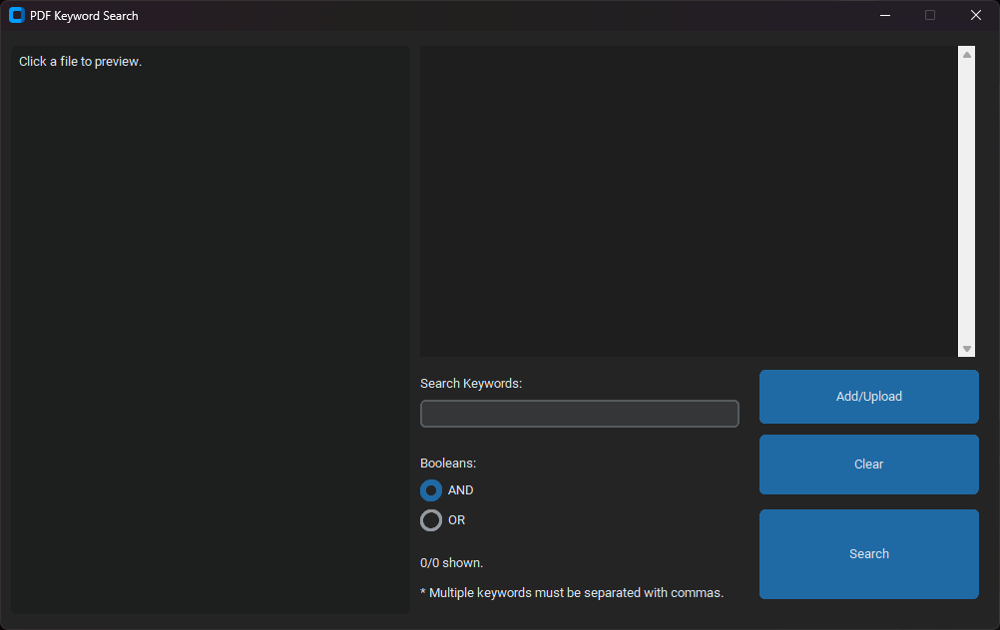
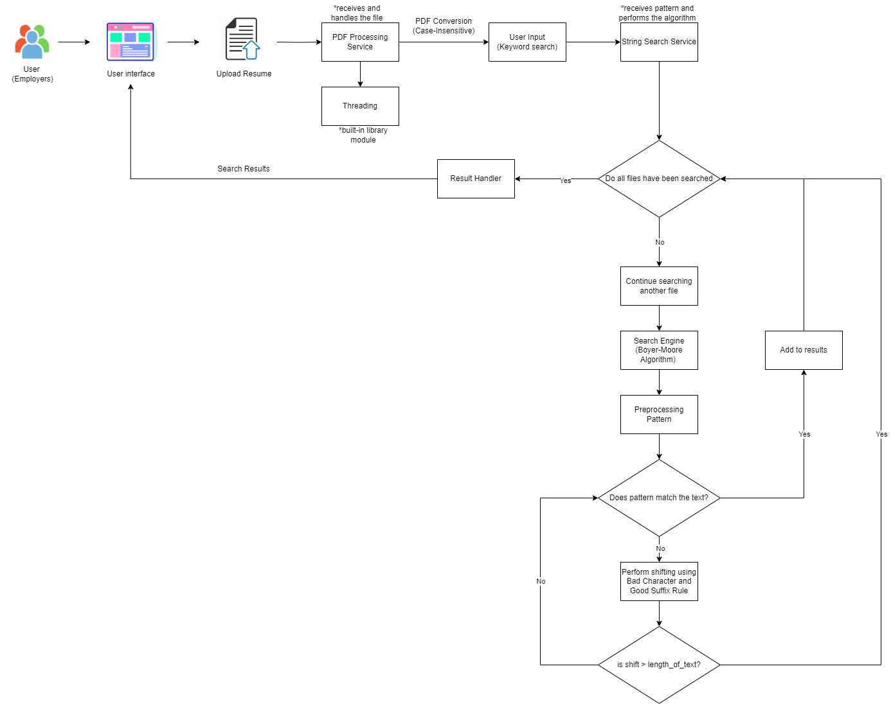

# PDF Keyword Search Engine

A tool to search keywords on multiple PDF files using Boyer-Moore Search Matching Algorithm.



## System Architechture
The user will upload certain PDF Files that they want to scan through using specific keywords. They can choose either all or some of the keywords must be included in each PDF Files.

If the user is done searching, they can add more keywords until they are satisfied. 



## Developing
1. Fork this repository and clone it using git.
```
git clone https://github.com/<yourusername>/BugTIMERush.git
```
2. Head to your local repository and install the needed requirements for development.
```
pip install -r requirements.txt
```
3. Run the program
```
python main.py
```

## Special Thanks
This project has been made in partial fulfillment of the course requirement in Design and Analysis of Algorithms. I would like to say thank you to my professor for teaching us the lessons.

---
[](https://www.youtube.com/c/SmiliePop)[](https://reddit.com/user/lezzthanthree)
